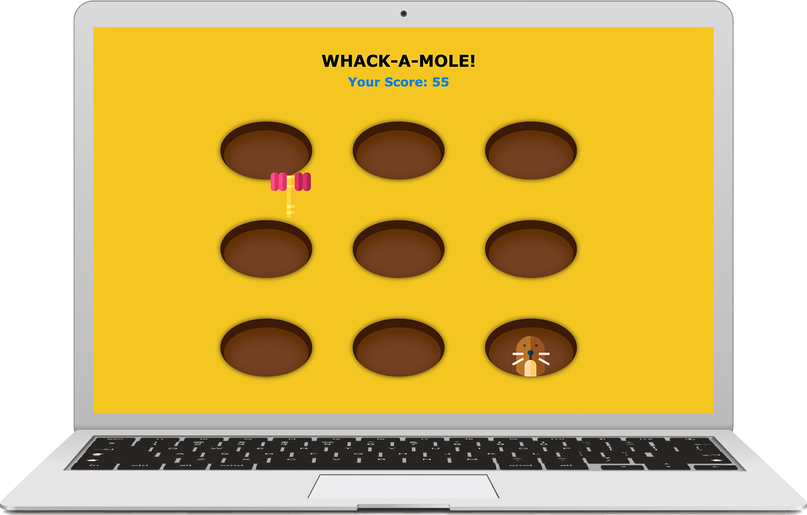

# Whack-a-mole

Play Rule: By clicking, whack a mole before they disappear.

### General Information

This mini game helped me to understand how to draw, write and insert images onto the <canvas> element.

[Demo](https://clairemolegame.netlify.app/)

## Screenshots

### Setup

1. Click on Go live present at the bottom of VS code.

## Room for Improvement

- Add "PLAY" start button
- different level of speed based on user performence.

## Acknowledgements

- This project was inspired by [HTML5 Canvas and JavaScript Game Tutorial](https://youtu.be/eI9idPTT0c4).
